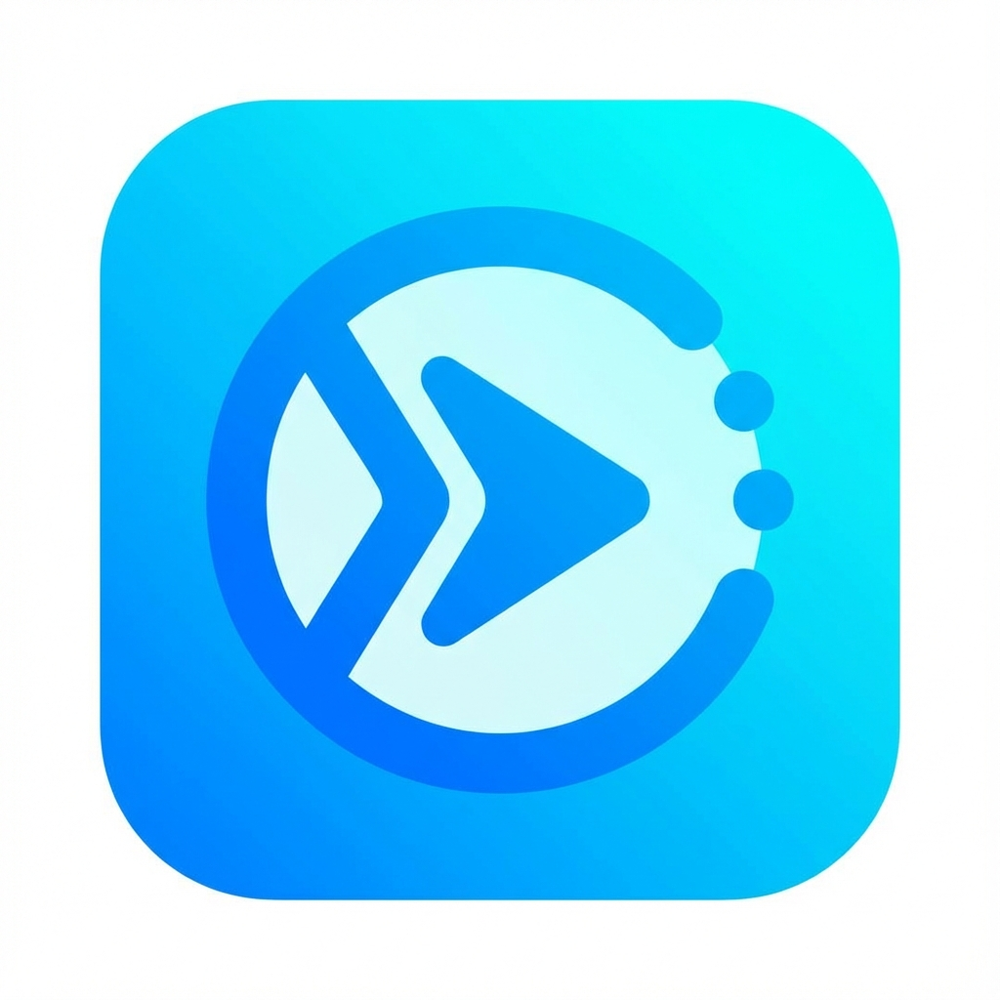
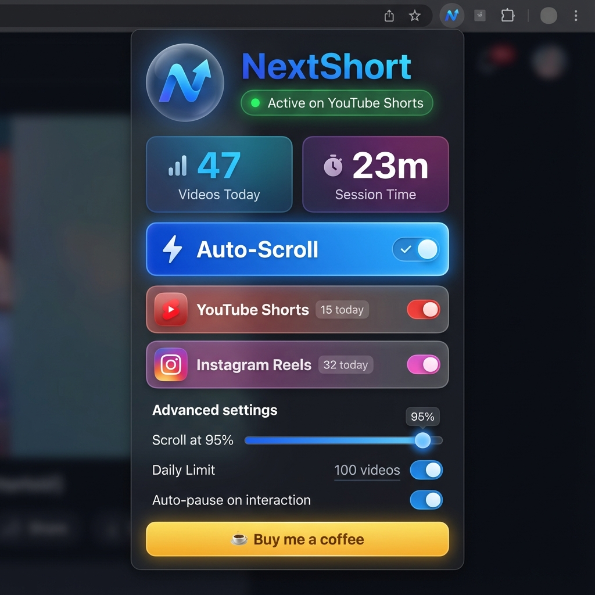

# NextShort 🚀

<div align="center">
    
    
[](https://buymeacoffee.com/nuhmanpk)
</div>

    


**NextShort** is a feature-rich Chrome extension that automatically scrolls to the next video on YouTube Shorts and Instagram Reels when the current one ends.

Designed for hands-free viewing with powerful customization options, real-time statistics, and smart health features that no other auto-scroll extension offers.

## ✨ Popup Interface

<div align="center">
    
    <p><em>Beautiful, modern interface with live statistics and customization</em></p>
</div>

## Features 🎯

### 🎬 **Platform Support**
- **YouTube Shorts**: Automatically scrolls to next short at customizable completion percentage
- **Instagram Reels**: Smart detection for Reels feed and Explore page
- **Instagram Explore**: Auto-clicks "Next" button on single reel views
- **SPA Support**: Seamlessly handles navigation between pages

### 📊 **Statistics Dashboard**
- **Real-time Video Counter**: Track how many videos you've watched today
- **Session Timer**: See your current watch session duration
- **Platform Breakdown**: Separate counters for YouTube and Instagram
- **Daily Auto-Reset**: Stats refresh automatically at midnight

### ⚙️ **Customization**
- **Scroll Timing Control**: Set when to scroll (50%-100% of video completion)
- **Daily Limits**: Set maximum videos per day to prevent endless scrolling
- **Auto-Pause on Interaction**: Pauses auto-scroll when you engage with content
- **Per-Platform Toggle**: Enable/disable YouTube and Instagram independently

### 🔍 **Smart Features**
- **Live Status Detection**: See if extension is active on current page
- **Script Injection Monitor**: Detects and fixes loading issues
- **One-Click Reload**: Instantly troubleshoot with reload button
- **Visual Feedback**: Animated indicators and smooth transitions

### 🎨 **Modern Design**
- Beautiful glassmorphic interface
- Auto dark mode support
- Platform-specific color themes
- Smooth micro-animations
- Professional polish

## Installation 🛠️

### From Source (Developer Mode)

1.  Clone this repository:
    ```bash
    git clone https://github.com/nuhmanpk/NextShort.git
    ```
2.  Open Chrome and navigate to `chrome://extensions/`.
3.  Enable **Developer mode** in the top right corner.
4.  Click **Load unpacked**.
5.  Select the `NextShort` directory.

## Usage 📖

1. **Install the extension** (see Installation section above)
2. **Navigate** to YouTube Shorts or Instagram Reels/Explore
3. **Watch it work!** Videos will auto-scroll when they finish
4. **Click the extension icon** to open the popup and:
   - View your daily statistics and session time
   - Adjust scroll timing (when to scroll to next video)
   - Set daily limits to control usage
   - Enable/disable per platform
   - Toggle auto-pause on interaction

## How it Works 🧠

### Core Functionality
NextShort uses intelligent content scripts that adapt to each platform:

**YouTube Shorts:**
- Monitors video playback using `timeupdate` events
- Tracks completion by URL to ensure continuous scrolling
- Scrolls at customizable percentage (default: 99%)
- Multiple fallback selectors for reliability
- Proper cleanup when switching videos

**Instagram Reels & Explore:**
- Detects page type (Reels feed vs Explore/single view)
- **Explore mode**: Clicks the "Next" button automatically
- **Reels mode**: Scrolls next video into viewport
- Dynamic re-detection for SPA navigation
- Smart video detection across different layouts

### Statistics & Tracking
- Tracks videos scrolled per platform using Chrome storage
- Session timer runs while popup is open
- Daily reset at midnight
- All data stored locally (privacy-first)

### Smart Features
- **Script injection detection**: Popup pings content script to verify it's loaded
- **Auto-reload**: One-click fix if script fails to inject
- **Real-time updates**: Stats refresh every 5 seconds in popup
- **Customizable timing**: Scroll percentage stored in sync storage

## Contributing 🤝

Contributions are welcome! Please open an issue or submit a pull request.

## License 📄

MIT License
